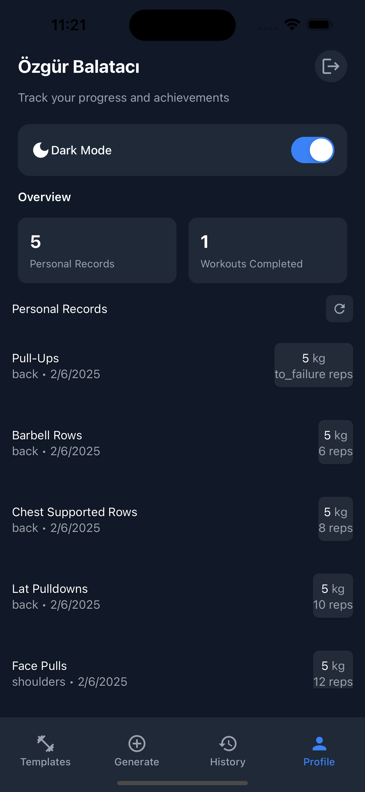
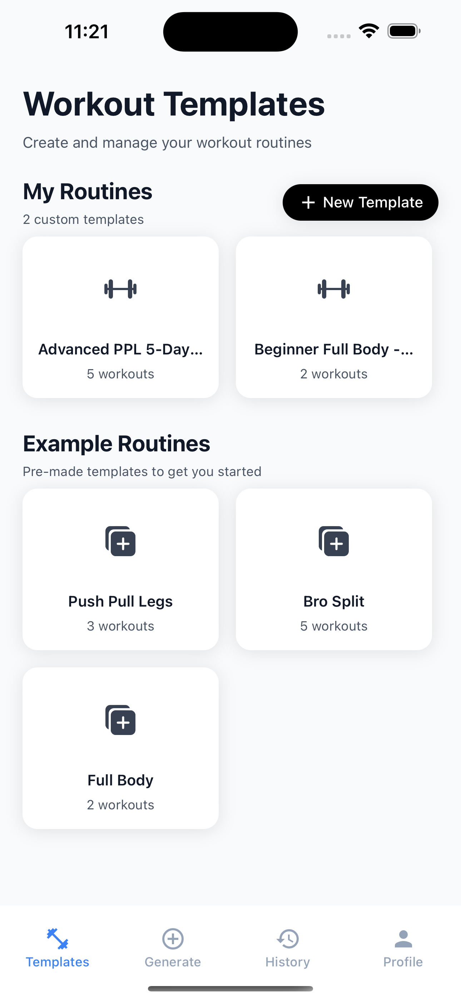
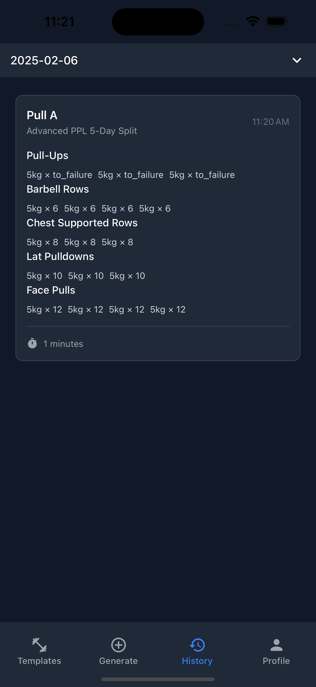
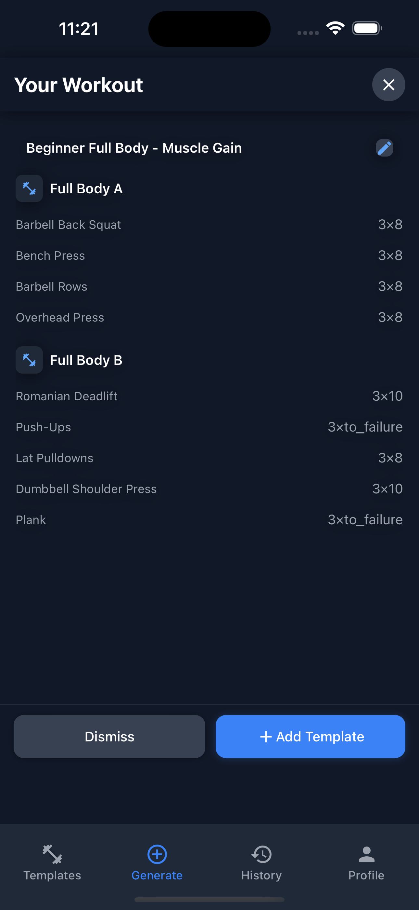
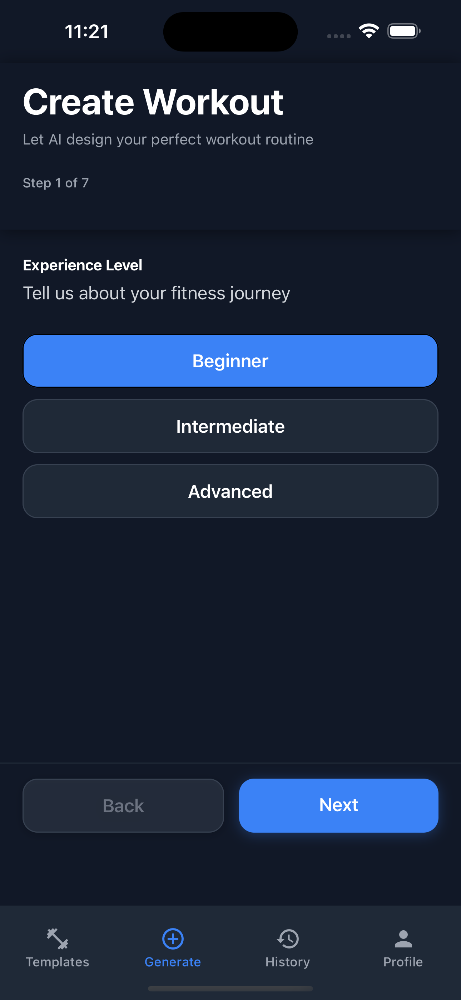
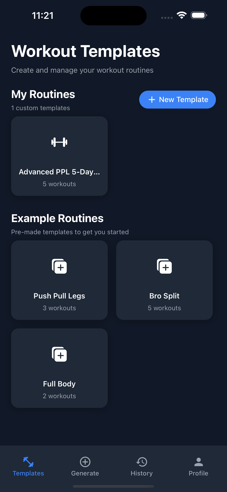

# Fitness Workout Tracker

A modern, intuitive workout tracking app built with React Native and Expo. Track your workouts, create custom templates, and monitor your progress all in one place.

## Features

- 📱 Cross-platform (iOS & Android)
- 💪 Create custom workout templates
- 🤖 AI-powered workout generation
- ⏱️ Built-in workout timer
- 📊 Track your progress and personal records
- 🌓 Light/Dark mode support
- 📝 Log completed workouts
- ⚡ Quick and responsive UI

## AI Workout Creation

The app features an intelligent workout generation system that helps you create personalized workout routines:

- **Smart Template Generation**: Input your goals, experience level, and available equipment to get a customized workout template
- **Exercise Selection**: AI analyzes your preferences and suggests optimal exercise combinations
- **Progressive Overload**: Automatically adjusts workout intensity based on your progress
- **Equipment Adaptation**: Suggests alternative exercises based on available equipment
- **Rest Day Planning**: Intelligently schedules rest days to optimize recovery
- **Workout Split Optimization**: Creates balanced workout splits for different muscle groups

To use the AI workout creation:

1. Navigate to the Create tab
2. Select "AI Workout Generation"
3. Fill in your preferences and constraints
4. Review and customize the generated workout
5. Save as a template or start immediately

## Screenshots

<div style="display: flex; flex-wrap: wrap; gap: 10px;">
    
    
    
    
    
    
</div>

## Tech Stack

- React Native
- Expo
- TypeScript
- TailwindCSS (NativeWind)
- MMKV Storage
- Expo Router
- OpenAI GPT-4 API (for workout generation)

## Getting Started

### Prerequisites

- Node.js (v16 or newer)
- npm or yarn
- Expo CLI
- iOS Simulator (for iOS development) or Android Studio (for Android development)
- OpenAI API Key (for AI workout generation)

### Installation

1. Clone the repository:

```bash
git clone https://github.com/oezguerbalataci/Fitness-Workout-Log.git
cd fitnessworkout
```

2. Install dependencies:

```bash
npm install
# or
yarn install
```

3. Set up environment variables:

```bash
# Create a .env file and add your OpenAI API key
OPENAI_API_KEY=your_api_key_here
```

### Running the App

Since this app uses MMKV for storage, it needs to be run as a native app. You cannot use Expo Go.

#### For iOS:

```bash
npx expo run:ios
```

#### For Android:

```bash
npx expo run:android
```

Note: For iOS, you need a Mac with Xcode installed. For Android, you need Android Studio with an emulator set up.

#### Development Workflow

After the initial build, you can use the following command for development with hot reload:

```bash
npx expo start --dev-client
```

Then open the app on your device/emulator. Make sure your device is on the same network as your development machine.

### Building for Distribution

To create a standalone build:

```bash
# For Android
npx eas build --platform android

# For iOS (requires Apple Developer Account)
npx eas build --platform ios
```

## Project Structure

```
fitnessworkout/
├── app/                    # App screens and navigation
├── src/
│   ├── components/        # Reusable components
│   ├── store/            # State management
│   ├── types/            # TypeScript types
│   ├── utils/            # Helper functions
│   └── ai/               # AI workout generation logic
├── assets/               # Images, fonts, etc.
└── ...
```

## Contributing

1. Fork the repository
2. Create your feature branch (`git checkout -b feature/amazing-feature`)
3. Commit your changes (`git commit -m 'Add some amazing feature'`)
4. Push to the branch (`git push origin feature/amazing-feature`)
5. Open a Pull Request

## License

This project is licensed under the MIT License - see the LICENSE file for details.
