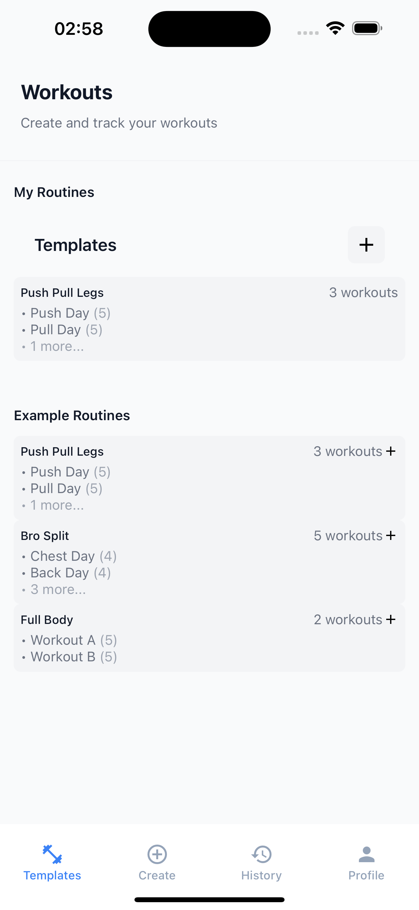
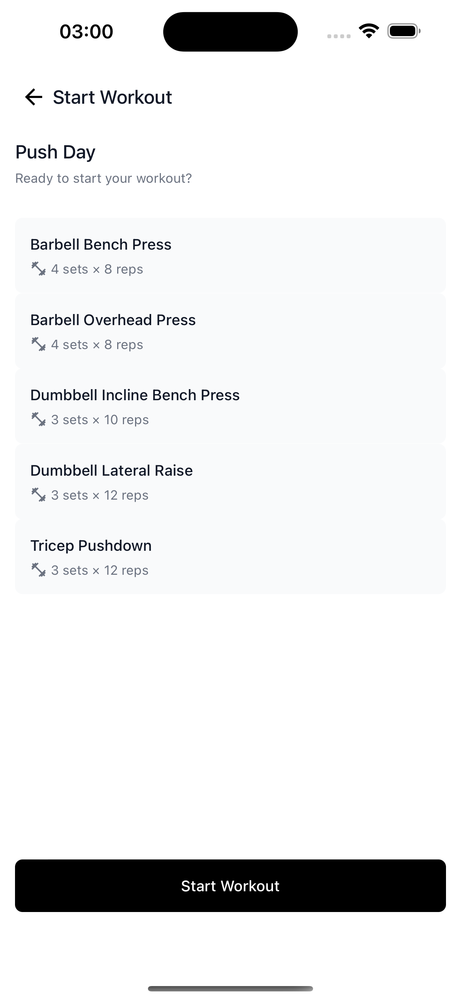
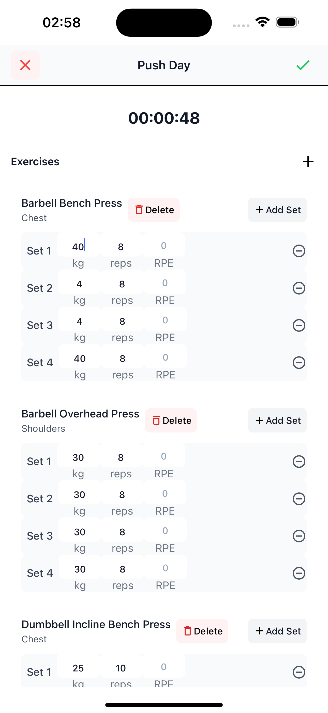
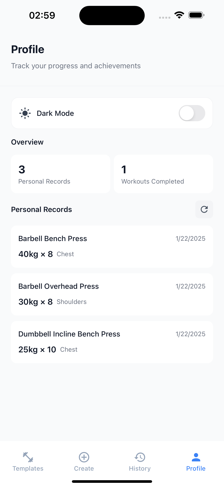
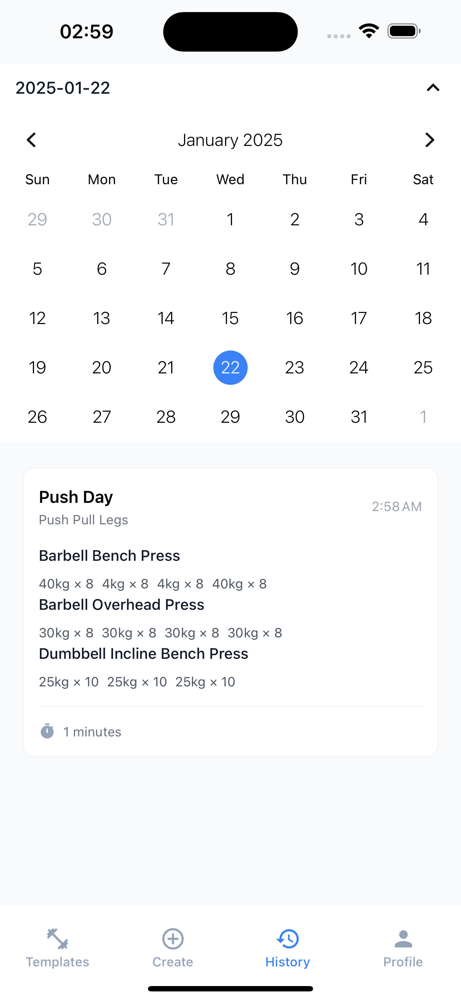

# Fitness Workout Tracker

A modern, intuitive workout tracking app built with React Native and Expo. Track your workouts, create custom templates, and monitor your progress all in one place.

## Features

- 📱 Cross-platform (iOS & Android)
- 💪 Create custom workout templates
- ⏱️ Built-in workout timer
- 📊 Track your progress and personal records
- 🌓 Light/Dark mode support
- 📝 Log completed workouts
- ⚡ Quick and responsive UI

## Screenshots

<div style="display: flex; flex-wrap: wrap; gap: 10px;">
    
    
    
    
    
</div>

## Tech Stack

- React Native
- Expo
- TypeScript
- TailwindCSS (NativeWind)
- MMKV Storage
- Expo Router

## Getting Started

### Prerequisites

- Node.js (v16 or newer)
- npm or yarn
- Expo CLI
- iOS Simulator (for iOS development) or Android Studio (for Android development)

### Installation

1. Clone the repository:

```bash
git clone [your-repository-url]
cd fitnessworkout
```

2. Install dependencies:

```bash
npm install
# or
yarn install
```

3. Start the development server:

```bash
npx expo start
```

### Running on Device

#### Using Expo Go (Easiest)

1. Install Expo Go on your device
2. Scan the QR code from the terminal
3. The app will open in Expo Go

#### Building a Development Build

```bash
# For Android
npx eas build --profile development --platform android

# For iOS (requires Apple Developer Account)
npx eas build --profile development --platform ios
```

## Project Structure

```
fitnessworkout/
├── app/                    # App screens and navigation
├── src/
│   ├── components/        # Reusable components
│   ├── store/            # State management
│   ├── types/            # TypeScript types
│   └── utils/            # Helper functions
├── assets/               # Images, fonts, etc.
└── ...
```

## Contributing

1. Fork the repository
2. Create your feature branch (`git checkout -b feature/amazing-feature`)
3. Commit your changes (`git commit -m 'Add some amazing feature'`)
4. Push to the branch (`git push origin feature/amazing-feature`)
5. Open a Pull Request

## License

This project is licensed under the MIT License - see the LICENSE file for details.
